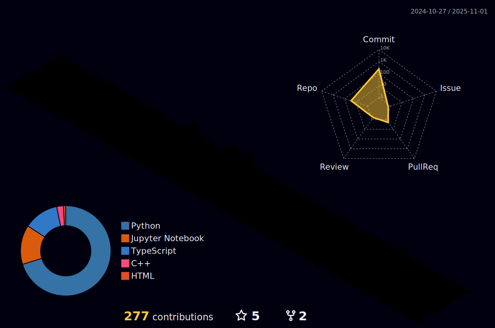

## Connect With Me 📫 

  

  

  

### Glad to see you here!  
-I am a dedicated Engineering Undergraduate at Moratuwa University, Sri Lanka, with a profound passion for both Machine Learning and Software Engineering. My academic journey is deeply rooted in AI, ML, and Deep Learning, complemented by my studies in software engineering.

-As a tech enthusiast, I have self-taught skills in machine learning and deep learning, which I continually refine through practical applications and research. I am actively seeking opportunities to participate in projects that bridge theoretical knowledge and real-world problem-solving, aiming to contribute innovative solutions and insights in the fields of AI and software engineering.

-My commitment to continuous learning and development defines my journey in technology, positioning me as an aspiring professional ready to tackle complex challenges and drive advancements in both machine learning and software engineering.
   

- ## Languages and Tools  

  
  
  
  

 

  
  
  
  
  
  
  
  
  
  

- ## Github Stats  

|  | 
&nbsp;
 |
| ------------- | -------------- |

  
  

----

